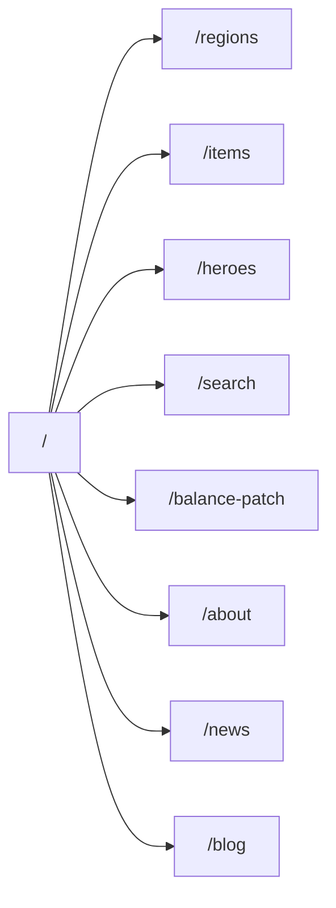
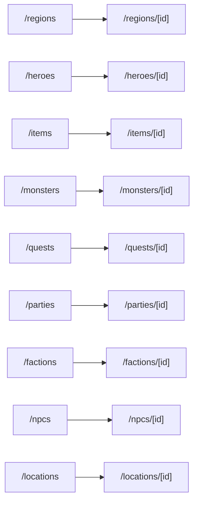

# Site Map And Transitions

This document defines the app route map and the expected user transitions.
Individual page specs own page-level blocks and states; this document owns how
the pages connect.

## Route Groups

| Group | Routes | Navigation role |
|---|---|---|
| Entry | `/` | First impression and capability routing. |
| Architecture | `/about` | Explains the 80/20 story and system design. |
| Dictionary catalogs | `/regions`, `/heroes`, `/items`, `/monsters`, `/quests`, `/parties`, `/factions`, `/npcs`, `/locations`, `/classes`, `/abilities` | Browse Revisium data tables. |
| Dictionary details | `/regions/[id]`, `/heroes/[id]`, `/items/[id]`, `/monsters/[id]`, `/quests/[id]`, `/parties/[id]`, `/factions/[id]`, `/npcs/[id]`, `/locations/[id]` | Inspect rich rows, FKs, files, formulas, and federation. |
| Discovery | `/search` | Search across data and CMS. |
| Revision story | `/balance-patch` | Compare `head` and `draft`. |
| CMS | `/blog`, `/blog/[slug]`, `/news`, `/news/[slug]` | Show marketing/editorial content from Revisium. |

## Primary Navigation

Top-level navigation should stay compact:

| Nav item | Target | Notes |
|---|---|---|
| Home | `/` | Brand link. |
| Data | `/regions` | First catalog; may expose menu to other catalogs. |
| Search | `/search` | Global search entry once implemented. |
| Branching | `/balance-patch` | Revision story. |
| About | `/about` | Architecture and source story. |
| News | `/news` | Primary editorial surface; `/blog` remains reachable from content and stubs. |

Do not put every route in the top nav. Detail pages are reached from catalogs,
search, or related links.

## Global Transitions

| From | Trigger | To |
|---|---|---|
| Any page | Brand click | `/` |
| Any page | About/footer architecture link | `/about` |
| Any page | Search submit | `/search?q=...` once query params are implemented |
| Any data page | Cloud link in widget | External `cloud.revisium.io` table/row/schema |
| Any data page | REST/OpenAPI link in widget | External backend Swagger/OpenAPI |
| Any data page | MCP link in widget | Docs/tool reference |

## Entry Flow

## Dictionary Flow

## Cross-Entity Transitions

| Source route | Link target | Why |
|---|---|---|
| `/heroes` | `/heroes/[id]` | Open a hero row. |
| `/heroes/[id]` | `/classes`, `/regions/[id]`, `/factions/[id]`, `/abilities`, `/items/[id]` | Single FK, array FK, inventory references. |
| `/items` | `/items/[id]` | Open item detail. |
| `/items/[id]` | `/heroes`, `/quests`, `/monsters` where reverse links exist | Show where item is used. |
| `/monsters/[id]` | `/factions/[id]`, `/abilities`, `/items/[id]` | Faction, abilities, drops. |
| `/quests/[id]` | `/npcs/[id]`, `/locations/[id]`, `/items/[id]` | Quest giver, location, rewards. |
| `/parties/[id]` | `/heroes/[id]` | Party member array FK. |
| `/factions/[id]` | `/heroes/[id]`, `/monsters/[id]` | Reverse faction relationships. |
| `/npcs/[id]` | `/locations/[id]` | NPC location FK. |
| `/locations/[id]` | `/regions/[id]`, `/quests`, `/npcs` | Region FK and related content. |

When a target route is not implemented yet, the UI may show only the cloud link
or hide the app link. Do not render dead internal links.

## CMS Transitions

| From | Trigger | To |
|---|---|---|
| `/news` | Open news card | `/news/[slug]` |
| `/news/[slug]` | Back action | `/news` |
| `/blog` | Open blog card | `/blog/[slug]` |
| `/blog/[slug]` | Back action | `/blog` |
| `/about` | Read deeper CTA | `/blog/[slug]` or source repo |
| `/news/[slug]` | Capability CTA | Relevant proof page such as `/items` or `/balance-patch` |

## Search Transitions

| Result type | Preferred target | Fallback |
|---|---|---|
| Region | `/regions/[id]` | Cloud row |
| Hero | `/heroes/[id]` | Cloud row |
| Item | `/items/[id]` | Cloud row |
| Monster | `/monsters/[id]` | Cloud row |
| Quest | `/quests/[id]` | Cloud row |
| Party | `/parties/[id]` | Cloud row |
| Faction | `/factions/[id]` | Cloud row |
| NPC | `/npcs/[id]` | Cloud row |
| Location | `/locations/[id]` | Cloud row |
| Class | `/classes` filtered/focused | Cloud row |
| Ability | `/abilities` filtered/focused | Cloud row |
| Blog post | `/blog/[slug]` | Cloud row |
| News post | `/news/[slug]` | Cloud row |

## Back Behaviour

- Catalog to detail: breadcrumb returns to the catalog route.
- Filtered catalog to detail: preserve the browser back stack; do not override native back.
- Detail to related detail: breadcrumb points to that entity's catalog, while browser back returns to source.
- External cloud/source links open new tabs.

## URL State

For v1, use URL query params for shareable state where it materially helps:

| State | URL param recommendation |
|---|---|
| Search query | `q` |
| Locale | `locale` only if global persistence is not implemented elsewhere |
| Catalog filters | Use stable field names for major filters after query shape is confirmed |
| Cursor | Avoid putting cursor in URL unless pagination deep links become required |
| Revision | `revision=head\|draft` on `/balance-patch` |

## Implementation Rule

If a new transition is added in code, update this document and the relevant page
spec in the same PR. If a link cannot be implemented yet because the target
route or data is blocked, keep the transition documented and mark the page spec
or inventory row as blocked.
