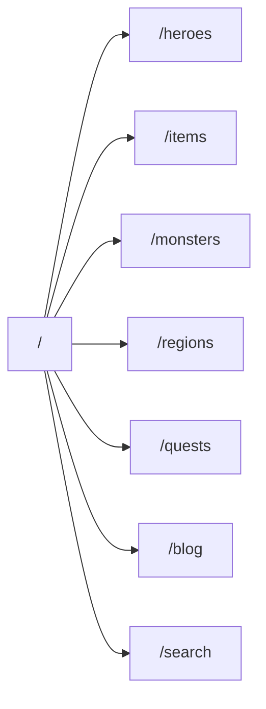
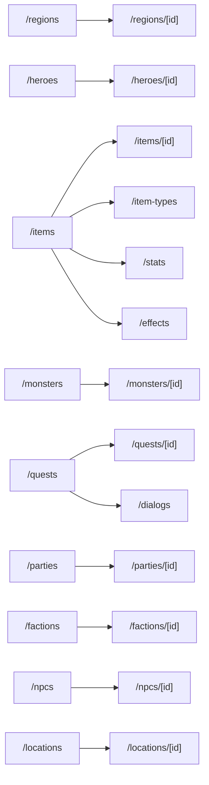

# Site Map And Transitions

This document defines the app route map and the expected user transitions.
Individual page specs own page-level blocks and states; this document owns how
the pages connect.

## Route Groups

| Group                  | Routes                                                                                                                                                                             | Navigation role                                                          |
| ---------------------- | ---------------------------------------------------------------------------------------------------------------------------------------------------------------------------------- | ------------------------------------------------------------------------ |
| Entry                  | `/`                                                                                                                                                                                | Codex home and capability routing.                                       |
| Architecture           | `/about`                                                                                                                                                                           | Secondary technical explanation route, not a primary nav item.           |
| Game database catalogs | `/regions`, `/heroes`, `/items`, `/monsters`, `/quests`, `/parties`, `/factions`, `/npcs`, `/locations`, `/classes`, `/abilities`, `/item-types`, `/stats`, `/effects`, `/dialogs` | Browse game-facing entity collections.                                   |
| Game database details  | `/regions/[id]`, `/heroes/[id]`, `/items/[id]`, `/monsters/[id]`, `/quests/[id]`, `/parties/[id]`, `/factions/[id]`, `/npcs/[id]`, `/locations/[id]`                               | Inspect rich entities, related content, files, formulas, and federation. |
| Discovery              | `/search`                                                                                                                                                                          | Search across data and CMS.                                              |
| Revision story         | `/balance-patch`                                                                                                                                                                   | Compare `head` and `draft`.                                              |
| Guides and updates     | `/blog`, `/blog/[slug]`                                                                                                                                                            | Show guide/article content from `cms.blog_posts` and `cms.blog_authors`. |
| News                   | `/news`, `/news/[slug]`                                                                                                                                                            | Blocked until a news data source is confirmed.                           |

## Primary Navigation

Top-level navigation v1 has no section dropdowns. It uses direct route links
only, plus a compact language button:

| Nav item | Target        | Notes                                                                                          |
| -------- | ------------- | ---------------------------------------------------------------------------------------------- |
| Home     | `/`           | Brand link.                                                                                    |
| Heroes   | `/heroes`     | Top-level hero catalog.                                                                        |
| Items    | `/items`      | Top-level item catalog.                                                                        |
| Monsters | `/monsters`   | Top-level monster catalog.                                                                     |
| World    | `/regions`    | World family entry point.                                                                      |
| Quests   | `/quests`     | Quest catalog.                                                                                 |
| Guides   | `/blog`       | Guide/article catalog backed by `cms.blog_posts`; do not claim news is implemented.            |
| Search   | `/search`     | Global search entry once implemented.                                                          |
| Language | Header button | Shows the current language, for example `EN`, `RU`, or `ZH`; may open a compact language menu. |

Do not add top-nav dropdowns for route navigation in v1. Detail pages and
secondary catalogs are reached from catalogs, search, related links, or section
subnav. The language menu is not a route-navigation dropdown and must not become
a technical settings panel.

## Section Subnav

Catalog and detail pages may show a section-level horizontal subnav below the
page header. This is where secondary entity routes live; the header remains
direct-link only.

| Family   | Routes                                                   |
| -------- | -------------------------------------------------------- |
| Heroes   | `/heroes`, `/classes`, `/abilities`, `/npcs`, `/parties` |
| Items    | `/items`, `/item-types`, `/stats`, `/effects`            |
| Monsters | `/monsters`                                              |
| World    | `/regions`, `/locations`, `/factions`                    |
| Quests   | `/quests`, `/dialogs`                                    |

When a target route is not wired yet, the subnav item stays documented but is
not rendered as a dead internal link. When a target route exists only as a stub,
the subnav may link to the stub and the page must keep its inventory status
visible.

## Global Transitions

| From          | Trigger                        | To                                                |
| ------------- | ------------------------------ | ------------------------------------------------- |
| Any page      | Brand click                    | `/`                                               |
| Any page      | About/footer architecture link | `/about`                                          |
| Any page      | Search submit                  | `/search?q=...` once query params are implemented |
| Any data page | Cloud link in widget           | External `cloud.revisium.io` table/row/schema     |
| Any data page | REST/OpenAPI link in widget    | External backend Swagger/OpenAPI                  |
| Any data page | MCP link in widget             | Docs/tool reference                               |

## Entry Flow

## Game Database Flow

## Cross-Entity Transitions

| Source route      | Link target                                                                                      | Why                                          |
| ----------------- | ------------------------------------------------------------------------------------------------ | -------------------------------------------- |
| `/heroes`         | `/heroes/[id]`                                                                                   | Open a hero row.                             |
| `/heroes/[id]`    | `/classes`, `/regions/[id]`, `/factions/[id]`, `/abilities`, `/items/[id]`                       | Single FK, array FK, inventory references.   |
| `/items`          | `/items/[id]`                                                                                    | Open item detail.                            |
| `/items/[id]`     | `/heroes`, `/quests`, `/monsters`, `/item-types`, `/stats`, `/effects` where reverse links exist | Show where item is used and how it is typed. |
| `/monsters/[id]`  | `/factions/[id]`, `/abilities`, `/items/[id]`                                                    | Faction, abilities, drops.                   |
| `/quests/[id]`    | `/npcs/[id]`, `/locations/[id]`, `/items/[id]`, `/dialogs`                                       | Quest giver, location, rewards, dialog.      |
| `/parties/[id]`   | `/heroes/[id]`                                                                                   | Party member array FK.                       |
| `/factions/[id]`  | `/heroes/[id]`, `/monsters/[id]`                                                                 | Reverse faction relationships.               |
| `/npcs/[id]`      | `/locations/[id]`                                                                                | NPC location FK.                             |
| `/locations/[id]` | `/regions/[id]`, `/quests`, `/npcs`                                                              | Region FK and related content.               |

When a target route is not implemented yet, the UI may hide the app link and
leave the source evidence in the Explainer Widget. Do not render dead internal
links.

## CMS Transitions

| From           | Trigger         | To                                              |
| -------------- | --------------- | ----------------------------------------------- |
| `/blog`        | Open blog card  | `/blog/[slug]`                                  |
| `/blog/[slug]` | Back action     | `/blog`                                         |
| `/about`       | Read deeper CTA | `/blog/[slug]` or source repo                   |
| `/news`        | Open news card  | Blocked until a news table/source is confirmed. |
| `/news/[slug]` | Capability CTA  | Blocked until a news table/source is confirmed. |

## Search Transitions

| Result type | Preferred target                              | Fallback  |
| ----------- | --------------------------------------------- | --------- |
| Region      | `/regions/[id]`                               | Cloud row |
| Hero        | `/heroes/[id]`                                | Cloud row |
| Item        | `/items/[id]`                                 | Cloud row |
| Monster     | `/monsters/[id]`                              | Cloud row |
| Quest       | `/quests/[id]`                                | Cloud row |
| Party       | `/parties/[id]`                               | Cloud row |
| Faction     | `/factions/[id]`                              | Cloud row |
| NPC         | `/npcs/[id]`                                  | Cloud row |
| Location    | `/locations/[id]`                             | Cloud row |
| Class       | `/classes` filtered/focused                   | Cloud row |
| Ability     | `/abilities` filtered/focused                 | Cloud row |
| Item type   | `/item-types` filtered/focused                | Cloud row |
| Stat        | `/stats` filtered/focused                     | Cloud row |
| Effect      | `/effects` filtered/focused                   | Cloud row |
| Dialog      | `/dialogs` filtered/focused                   | Cloud row |
| Blog post   | `/blog/[slug]`                                | Cloud row |
| News post   | `/news/[slug]` only after source confirmation | Cloud row |

## Back Behaviour

- Catalog to detail: breadcrumb returns to the catalog route.
- Filtered catalog to detail: preserve the browser back stack; do not override native back.
- Detail to related detail: breadcrumb points to that entity's catalog, while browser back returns to source.
- External cloud/source links open new tabs.

## URL State

For v1, use URL query params for shareable state where it materially helps:

| State           | URL param recommendation                                                 |
| --------------- | ------------------------------------------------------------------------ |
| Search query    | `q`                                                                      |
| Locale          | `locale` only if global persistence is not implemented elsewhere         |
| Catalog filters | Use stable field names for major filters after query shape is confirmed  |
| Cursor          | Avoid putting cursor in URL unless pagination deep links become required |
| Revision        | `revision=head\|draft` on `/balance-patch`                               |

## Implementation Rule

If a new transition is added in code, update this document and the relevant page
spec in the same PR. If a link cannot be implemented yet because the target
route or data is blocked, keep the transition documented and mark the page spec
or inventory row as blocked.
